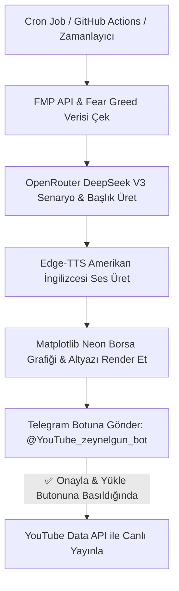

# 🚀 US Stock Market Daily - Otomatik YouTube Video Motoru Projesi

Bu belge, `@zeynelgun1` YouTube kanalı için geliştirilen sıfır/mikro maliyetli, tam otomatik, DeepSeek V3 destekli ve Telegram onaylı ABD borsa video üretim sisteminin tüm özetini içermektedir.

---

## 📌 1. Proje Amacı ve Yayın Stratejisi

- **Kanal Konsepti:** US Stock Market Daily (ABD Borsa ve Finans Haberleri)
- **Hedef Kitle:** ABD Borsa Yatırımcıları ve Finans İzleyicileri (İngilizce İçerik)
- **Yayın Frekansı:** Günde 2 Shorts + 1 Uzun Piyasaya Kapanış Özeti Videosu
- **ABD Peak Hours Yayın Saati (TSI / Turkey Time):**
  1. 🟢 **15:30 TSI** (08:30 EST) ➔ Pre-Market Shorts (Açılış Öncesi Haberler)
  2. 🟢 **20:00 TSI** (13:00 EST) ➔ Mid-Day Shorts (Gün Ortası Sıcak Hisseler)
  3. 🟢 **23:30 TSI** (16:30 EST) ➔ Post-Market Long Video (Günlük Piyasa Kapanış Özeti)

---

## 🛠️ 2. Teknoloji Mimarisi (Tech Stack)

| Bileşen | Kullanılan Teknoloji | Maliyet / Açıklama |
| :--- | :--- | :--- |
| **Canlı Veri Kaynağı** | `FMP API` + `CNN Fear & Greed` | $0 (Var olan FMP API planınız + Canlı Borsa Verisi) |
| **Yapay Zeka (LLM)** | `DeepSeek V3` (`deepseek/deepseek-chat`) & `Qwen 2.5 72B` (OpenRouter) | ~$0.0001 / Video (Ultra ucuz Çinli modeller) |
| **Seslendirme (TTS)** | `Edge-TTS` (`en-US-ChristopherNeural`) | $0 (Stüdyo kalitesinde doğal Amerikan İngilizcesi) |
| **Görsel & Grafik** | `Matplotlib` + `PIL` + `FFmpeg` | 1080x1920 HD (4.1 Mbps / 30 FPS) Canlı Neon Borsa Grafiği Kartları |
| **Dinamik Altyazı** | `ASS Subtitle Generator` | Kelime bazlı Alex Hormozi tarzı sarı/beyaz konturlu dikey altyazılar |
| **Telegram Onay Botu** | `@YouTube_zeynelgun_bot` | Canlı `answerCallbackQuery` dinleyicisi ile buton onay mekanizması |
| **YouTube Yükleme** | `YouTube Data API v3` + `OAuth 2.0` | `client_secret.json` ve `token.json` ile sıfır etkileşimli otomatik yükleme |
| **Bulut Çalıştırma** | `GitHub Actions` (`zeynelgun-afk/yt-stock-automation`) | %100 Ücretsiz GitHub bulut sunucularında 7/24 kesintisiz zamanlayıcı |

---

## 🔄 3. Tam Otomatik Çalışma Akışı (Workflow)



---

## 🎬 4. Başarıyla Test Edilen ve Yayınlanan Canlı Videolar

1. **Test #1 (Temel Ses & Render):** [https://youtu.be/BDKLCdTmRus](https://youtu.be/BDKLCdTmRus)
2. **Test #2 (HD Neon Borsa Grafiği & Görsel Render):** [https://youtu.be/aGgeAX16QHg](https://youtu.be/aGgeAX16QHg)
3. **Test #3 (DeepSeek V3 + Telegram Onayı + Canlı YouTube Yüklemesi):** [https://youtu.be/XAe0htKc8_w](https://youtu.be/XAe0htKc8_w) 🌟

---

## 📂 5. Proje Klasörü ve Dosya Yapısı

Projeniz bilgisayarınızda **`finzora`** projenizin yanına düzenli şekilde kurulmuştur:
📁 **Konum:** `/home/zeynel/Belgeler/yt-stock-automation`
🔗 **GitHub Deposu:** [https://github.com/zeynelgun-afk/yt-stock-automation](https://github.com/zeynelgun-afk/yt-stock-automation) (Private)

### Temel Dosyalar:
- **`config.py`:** Ortam değişkenleri, çözünürlükler ve ses ayarları.
- **`data_fetcher.py`:** FMP API ve Fear&Greed canlı veri çekicisi.
- **`script_generator.py`:** OpenRouter DeepSeek V3 ve Qwen 2.5 senaryo motoru.
- **`voice_generator.py`:** Edge-TTS seslendirme motoru.
- **`subtitle_generator.py`:** Dikey Shorts altyazı üreticisi.
- **`video_engine.py`:** PIL, Matplotlib neon grafik ve FFmpeg HD render motoru.
- **`telegram_bot.py`:** `@YouTube_zeynelgun_bot` buton onay dinleyicisi.
- **`youtube_publisher.py`:** YouTube OAuth 2.0 yükleme motoru.
- **`main_scheduler.py`:** Ana zamanlayıcı ve orkestratör script.
- **`.github/workflows/youtube_auto.yml`:** Bulutta %100 ücretsiz çalıştırma dosyası.

---

## ⚙️ 6. Nasıl Çalıştırılır?

### Manuel Test Çalıştırmak İçin:
```bash
cd /home/zeynel/Belgeler/yt-stock-automation
./venv/bin/python main_scheduler.py
```

### Bulutta Otomatik Çalışma:
Bilgisayarınız kapalı olsa dahi GitHub Actions bulut sunucusu her gün **15:30 TSI**, **20:00 TSI** ve **23:30 TSI** saatlerinde otomatik olarak videoları üretip Telegram botunuza onay için gönderecektir.
